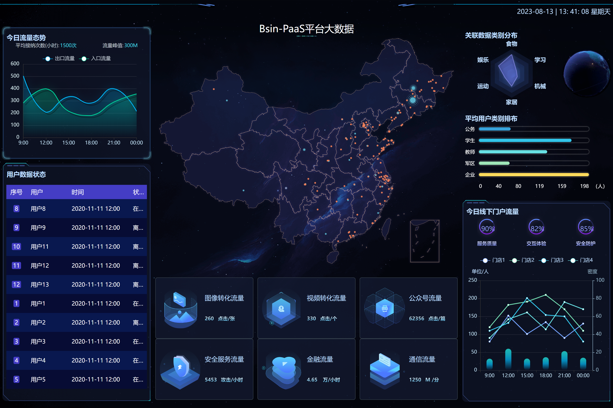

# jiujiu

### 介绍
Jiujiu是一个开放的区域数字商业生态构建平台。它依托区块链、人工智能和元宇宙等前沿技术，为实体品牌提供一站式Web3.0品牌打造服务。让同一区域内的各行各业参与者可以基于智能合约开展协作，实现资源高效配置，共建新的数字商业生态。

欢迎加入jiujiu，与我们共建区域数字商业的崭新未来！

### jiujiu产品的核心价值
- 一站式的Web3.0品牌构建服务
- 降低实体品牌的运营门槛
- 提高用户粘性和忠诚度
- 创建token经济激励用户
- 数据上链增加透明度和可验证性
- 用户拥有数据所有权,不受平台掌控,权益更加保障
- 商家拥有更多自主权,不受平台限制,更有竞争力
- 一款有温度的工具

### jiujiu应用场景
- 生活场景业态：水果店、咖啡店、小酒馆、茶艺师、餐馆

在jiujiu社区中，餐厅、超市、出行等服务商可以直接面向消费者提供商品和服务，同时也可以发行权益通证。消费者在享受服务的同时，还可以通过完成社区任务获取收益。这种模式建立了服务商和消费者之间更加对等透明的关系。

### jiujiu产品的功能组件

1. 商城和数字资产交易市集
- 餐厅、超市等可以开设数字店铺，提供商品和服务
2. 数字权益和数字积分系统
- 发行通证给商家和消费者，实现数字权益，NFT会员卡
3. 在线订单和支付功能
- 支持商家接单,消费者在线购买，集成数字支付解决方案
4. 线上线下运营融合
- App提供线上产品展示、订单，商家线下门店提供服务
5. 开放API接口
- 供开发者接入,开发创新应用
6. 生态伙伴入驻
- 孵化器、投资方等生态伙伴入驻
7. 社区论坛和活动、任务及提案
- 消费者交流,商家促销活动，去中心化社区管理
8. 数据分析和AI推荐
- 分析消费需求和行为,提供智能推荐服务
9. 共创分销
- 基于区块链的消费者 profiling 和信用体系
10. AR/VR场景打造
- 利用AR/VR,打造沉浸式购物体验 ,元宇宙空间打造
10. AI品牌运营官
- 通过AI及时提升品牌运营效率
11. web3 wallet
- 链接web2和web3，实现安全处理
12. 动态隐藏委员会
- 去中心化环境下安全计算

### 开发式设计

开发者可以利用jiujiu的开放接口，开发更多创新应用。创业者可以获得资源支持，并在这里孵化构建商业场景。投资人也可以及时了解区域商业的发展动态和投资机遇。
jiujiu让每一个参与其中的人都可以回归真实的生活和业务，共享数字化红利。这里将孕育一个活力四射、机会平等的共生生态。

### jiujiu设计图

### jiujiu UI

### 开源协议
apache license 2.0

* 允许免费用于学习.
* 商业用途需要授权.
* 对未经过授权进行二次开源或者商业化的将追究法律责任.

